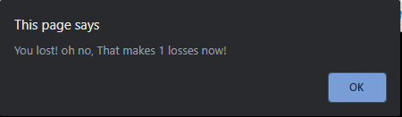
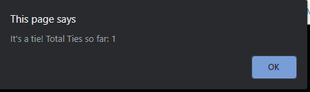
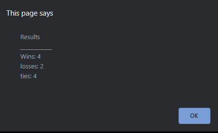

# myRPSgame-JS

## Class Assignment

***This assignment was about making a Rock, Paper, Scissor Game***

>Main Focus : 
    
    -Score Count
    -Prompting 
    -used JS ${} Method to render results

## Example Photos

# Final Message

## LINKS

- [javaScript101 Link] Coming Soon!
- [Github Repo Link](https://github.com/nicholasd-uci/myRPSgame-JS)

- - -
© 2020 NPRD, Nicholas Paul Ruiz Dallas