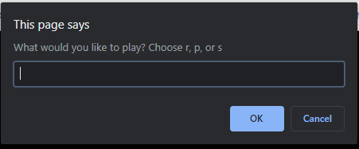
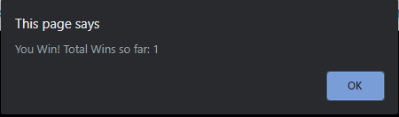

# myRPSgame-JS

## Class Assignment

***This assignment was about making a Rock, Paper, Scissor Game***

>Main Focus : 
    
    -Score Count
    -Prompting 
    -used JS ${} Method to render results

## Example Photos

